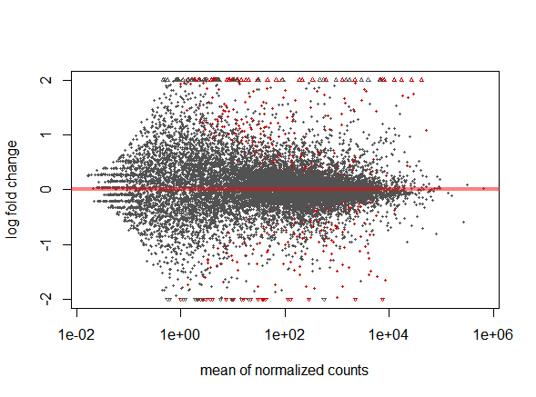
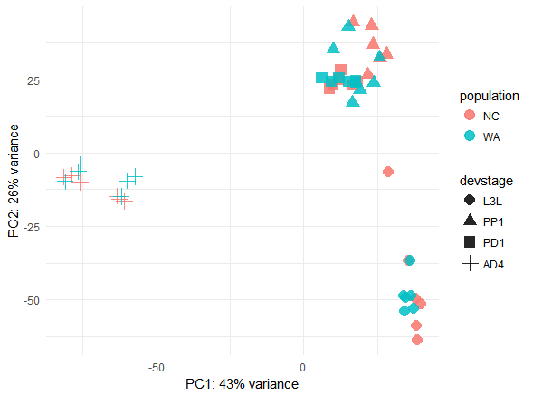
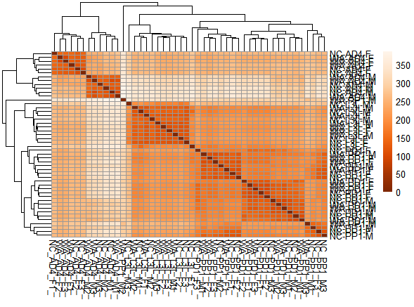
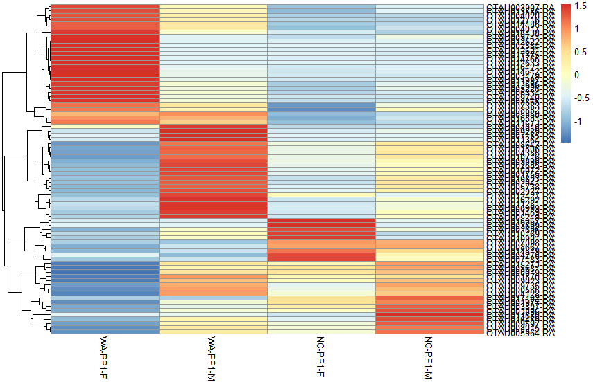
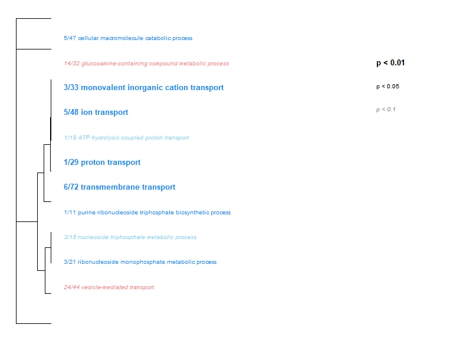
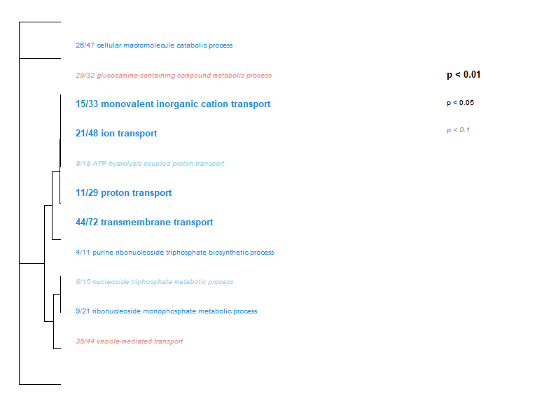

## Author: Suraj Bhattarai     
## Ecological Genomics:   

### Overall Description of notebook      

This notebook is to store all the codings and assignments that we do in Ecological Genomics class.


### Date started: 2018-01-24  
### Date end:   (year-month-day)    

### Philosophy   
Science should be reproducible and one of the best ways to achieve this is by logging research activities in a notebook. Because science/biology has increasingly become computational, it is easier to document computational projects in an electronic form, which can be shared online through Github.    

### Helpful features of the notebook     

**It is absolutely critical for your future self and others to follow your work.**     

* The notebook is set up with a series of internal links from the table of contents.    
* All notebooks should have a table of contents which has the "Page", date, and title (information that allows the reader to understand your work).     
* Also, one of the perks of keeping all activities in a single document is that you can **search and find elements quickly**.     
* Lastly, you can share specific entries because of the three "#" automatically creates a link when the notebook renders on github.      


<a rel="license" href="http://creativecommons.org/licenses/by/4.0/"></a><br />This work is licensed under a <a rel="license" href="http://creativecommons.org/licenses/by/4.0/">Creative Commons Attribution 4.0 International License</a>.  


### Table of contents for 60 entries (Format is *Page: Date(with year-month-day). Title*)        
* [Page 1: 2018-01-24](#id-section1). Intro to Github, RMarkdown, and UNIX command-line
* [Page 2: 2018-01-29](#id-section2). Working with RNAseq data of Beetles
* [Page 3: 2018-02-01](#id-section3). Clean using Trimmomatic
* [Page 4: 2018-02-05](#id-section4). Mapping the cleanreads into the reference genome
* [Page 5: 2018-02-07](#id-section5). Introduction to RNAseq data analysis by DESeq2
* [Page 6: 2018-02-12](#id-section6). RNAseq data analysis by DESeq2 - MA and PCA plot
* [Page 7: 2018-02-14](#id-section7). RNAseq data analysis - Heatmap of global gene expression and single transcript
* [Page 8: 2018-02-21](#id-section8). RNAseq data analysis - GO enrichment
* [Page 9: 2018-02-26](#id-section9). Population Genomics Day 1 - Intro into Genotype and SNP Calling
* [Page 10: 2018-02-28](#id-section10). Population Genomics Day 2 - Diversity and Site Frequency Spectrum
* [Page 11: Assignment 1 ](#id-section11).  RNA-seq for Gene Expression Analsysis
* [Page 12: 2018-03-05](#id-section12). Population Genomics Day 3 - Comaparing SNP and genotype calls results between samtools and read2snps
* [Page 13:2018-03-07](#id-section13). Population Genomics Day 4 - Site Frequency Spectrum (SFS) and Admixture Intro
* [Page 14:](#id-section14).
* [Page 15:](#id-section15).
* [Page 16:](#id-section16).
* [Page 17:](#id-section17).
* [Page 18:](#id-section18).
* [Page 19:](#id-section19).
* [Page 20:](#id-section20).
* [Page 21:](#id-section21).
* [Page 22:](#id-section22).
* [Page 23:](#id-section23).
* [Page 24:](#id-section24).
* [Page 25:](#id-section25).
* [Page 26:](#id-section26).
* [Page 27:](#id-section27).
* [Page 28:](#id-section28).
* [Page 29:](#id-section29).
* [Page 30:](#id-section30).
* [Page 31:](#id-section31).
* [Page 32:](#id-section32).
* [Page 33:](#id-section33).
* [Page 34:](#id-section34).
* [Page 35:](#id-section35).
* [Page 36:](#id-section36).
* [Page 37:](#id-section37).
* [Page 38:](#id-section38).
* [Page 39:](#id-section39).
* [Page 40:](#id-section40).
* [Page 41:](#id-section41).
* [Page 42:](#id-section42).
* [Page 43:](#id-section43).
* [Page 44:](#id-section44).
* [Page 45:](#id-section45).
* [Page 46:](#id-section46).
* [Page 47:](#id-section47).
* [Page 48:](#id-section48).
* [Page 49:](#id-section49).
* [Page 50:](#id-section50).
* [Page 51:](#id-section51).
* [Page 52:](#id-section52).
* [Page 53:](#id-section53).
* [Page 54:](#id-section54).
* [Page 55:](#id-section55).
* [Page 56:](#id-section56).
* [Page 57:](#id-section57).
* [Page 58:](#id-section58).
* [Page 59:](#id-section59).
* [Page 60:](#id-section60).

------
<div id='id-section1'/>
### Page 1: 2018-01-24. Notes on using Github, Rmarkdown, and the UNIX command-line

To log into the pbio381 server, i use ssh. Like this:


Open PuTTY program and enter following commands: 
```
Using username "sbhatta4".
sbhatta4@pbio381.uvm.edu's password:
Last login: Wed Jan 24 11:11:22 2018 from ip0af520ce.int.uvm.edu
[sbhatta4@pbio381 ~]$
```
To see the full directory, use pwd command

```
[sbhatta4@pbio381 ~]$ pwd
/users/s/b/sbhatta4
[sbhatta4@pbio381 ~]$

```

To make a directory, use mkdir command

To view all the directories, use ll command

To enter into a directory, use cd 'directory name' command

cd /data takes you into the shared space where you might find some data

```
[sbhatta4@pbio381 mydata]$ cd /data
[sbhatta4@pbio381 data]$ ll
total 12
drwxr-xr-x.  5 root     root       73 Jan 31  2017 archive
drwxr-xr-x.  2 srkeller users      49 Jan 23 13:20 external_data
drwxrwxr-x.  2 root     pb381adm   40 Nov 30  2015 packages
drwxrwxr-x. 48 root     pb381adm 4096 Mar 28  2017 popgen
drwxrwxr-x.  4 root     pb381adm   42 Jan 23 16:51 project_data
drwxrwxr-x.  2 root     pb381adm 4096 Aug  8 16:53 scripts
drwxr-xr-x. 21 root     root     4096 Feb  1  2017 users


```
To look what's in those files write cd 'file name'/ For e.g to see what's inside project_data folder, write cd project_data/ and write ll 

```
[sbhatta4@pbio381 data]$ cd project_data
[sbhatta4@pbio381 project_data]$ ll
total 4
drwxrwxr-x. 4 root pb381adm   35 Jan 23 16:52 beetles
drwxr-xr-x. 8 root pb381adm 4096 Jan 23 13:20 ssw


```
There are two folders beetles and ssw. Similarly, to see what's inside beetles write cd beetles/ and then write ll
```
drwxr-xr-x. 6 root pb381adm 86 Jan 23 16:52 archive
drwxr-xr-x. 2 root pb381adm 34 Jan 23 16:51 metadata
[sbhatta4@pbio381 beetles]$


```

Now when we opened metadata, then we find cols_data.txt. this is a text file, so it must conatain some information about the beetles. But we don't want to edit these contents in the shared space. So we need to first copy this file into our personal space. So we can now use cp commnad to copy it to our home directory. 

cp cols_data.txt ~/mydata/

```

-rwxr-xr-x. 1 root pb381adm 1474 Jan 23 16:50 cols_data.txt
[sbhatta4@pbio381 metadata]$ cp cols_data.txt ~/mydata/
[sbhatta4@pbio381 metadata]$


```

Now to see whether it has been copied to our personal folder or now, we need to open our home directory and check into  mydata by using ll 

```
[sbhatta4@pbio381 metadata]$ cd ~/mydata/
[sbhatta4@pbio381 mydata]$ ll
total 4
-rwxr-xr-x. 1 sbhatta4 users 1474 Jan 24 14:16 cols_data.txt


```
Now we want to see what's inside this file. We can use 'head' command to see the first 10 lines and 'tail' command to see the last 10 lines. 

```
sample_ID       population      devstage        sex
IT_AD4_F1_      IT      AD4     F
IT_AD4_F2_      IT      AD4     F
IT_AD4_F3_      IT      AD4     F
IT_AD4_M1_      IT      AD4     M
IT_AD4_M2_      IT      AD4     M
IT_AD4_M3_      IT      AD4     M
IT_ADC_F13      IT      ADC     F
IT_ADC_F14      IT      ADC     F
IT_ADC_F15      IT      ADC     F
[sbhatta4@pbio381 mydata]$ tail cols_data.txt
WA_PD1_F3_      WA      PD1     F
WA_PD1_M1_      WA      PD1     M
WA_PD1_M2_      WA      PD1     M
WA_PD1_M3_      WA      PD1     M
WA_PP1_F1_      WA      PP1     F
WA_PP1_F2_      WA      PP1     F
WA_PP1_F3_      WA      PP1     F
WA_PP1_M1_      WA      PP1     M
WA_PP1_M2_      WA      PP1     M
WA_PP1_M3_      WA      PP1     M


```
If we want to search specific thing in the file, we can use search command grep. For e.g. if we want to see only the samples from IT, then we should use grep 'IT' cols_data.txt


```
[sbhatta4@pbio381 mydata]$ grep 'IT' cols_data.txt
IT_AD4_F1_      IT      AD4     F
IT_AD4_F2_      IT      AD4     F
IT_AD4_F3_      IT      AD4     F
IT_AD4_M1_      IT      AD4     M
IT_AD4_M2_      IT      AD4     M
IT_AD4_M3_      IT      AD4     M
IT_ADC_F13      IT      ADC     F
IT_ADC_F14      IT      ADC     F
IT_ADC_F15      IT      ADC     F
IT_ADC_F1_      IT      ADC     F
IT_ADC_F2_      IT      ADC     F
IT_ADC_F3_      IT      ADC     F
IT_ADC_F4_      IT      ADC     F
IT_ADC_F5_      IT      ADC     F
IT_ADC_F6_      IT      ADC     F
IT_ADC_M10      IT      ADC     M
IT_ADC_M11      IT      ADC     M
IT_ADC_M12      IT      ADC     M
IT_ADC_M16      IT      ADC     M
IT_ADC_M17      IT      ADC     M
IT_ADC_M18      IT      ADC     M
IT_ADC_M7_      IT      ADC     M
IT_ADC_M8_      IT      ADC     M
IT_ADC_M9_      IT      ADC     M


```
If you want to rename the filename then you can use mv command. For this use mv file1 file2. This will rename file1 into file2. For e.g. if you do not like the name cols_data.txt, then you can change into beetles.txt by typing mv cols_data.txt beetles.txt

```
[sbhatta4@pbio381 mydata]$ mv cols_data.txt beetles.txt
[sbhatta4@pbio381 mydata]$ beetles.txt


```
If we want to save the output of command grep 'IT' beetles.txt into a separate file, then we should use following commands: grep 'IT' beetles.txt >beetles_ITonly.txt 

```

[sbhatta4@pbio381 mydata]$ grep 'IT' beetles.txt >beetles_ITonly.txt
[sbhatta4@pbio381 mydata]$ ll
total 8
-rw-r--r--. 1 sbhatta4 users  480 Jan 24 14:39 beetles_ITonly.txt
-rwxr-xr-x. 1 sbhatta4 users 1474 Jan 24 14:16 beetles.txt


```

------
<div id='id-section2'/>
### Page 2: 2018-01-29 Starting working with the bull headed beetle. 

### Overview
Raw data of RNA sequencing were provided by Prof. Melissa. The objectives of this 
class were to understand the biology of beetle, to familiarize with the general work flow
or "pipeline" for processing and analyzing RNAseq data and to visualize and interpret Illumina data quality
using a fastq file. 

### The Beetles

Onthophagus taurus beetles are native to the mediterranean and they were introduced to Australia in the late 1960s.
These were dung beetles and helped reduce fly pests and disease that were detrimental to the livestock. In 1970s,
these beetles were "accidentally" introduced to the eastern Unites States from an unknown origin. 

### Study Question
The study aimed to determine the genetic variation among the beetles which were native to Italy (IT), 
Western Australia (WA), and North Carolina (NC). RNA sequencing technique was employed to address this question. 
The samples were sequenced on about 7 lanes of Illumina HiSeq2500. 
### Samples
Three individuals of three given populations (IT, WA, NC) of four developmental stages viz. late third larval instar (L3L), pre-pupae day 1 (PP1), 
pupae day 1 (PD1), and adults four days after ecolsion (AD4) were collected for both the sexes. 
Total number of samples were thus 3 * 3 * 4 * 2 = 72 samples

### Pipeline
This refers to the entire process that the raw sequencing data goes through before we get some meaningful information out of it.
1. Visualizing and Cleaning data.
To visualize the quality of raw data, program FastQC is used and to clean the raw data, program Trimmomatic can be used. Later, the quality of cleaned data can be again visualized in FastQC.

The other steps of Pipeline would be updated after we actually do it.

### Working with RNAseq data
Raw RNA sequencing data from Beeltes were present in the shared space of our pbio381.uvm.edu server. 
One file containing raw RNA sequences were provided to each of us. We used the following codes to locate our files.
```
[sbhatta4@pbio381 data]$ cd project_data/beetles/rawdata/

```
Once we find the file. We used a command to see what's in the file. For this zcat command is used 

```
sbhatta4@pbio381 rawdata]$ zcat WA_PP1_M3_GTGAAA_L003_R2_001.fastq.gz | head -n4
```
In here, zcat is the command, and "WA...gz" is the file name. '| head - n4' means that the first four lines of the file will be shown. 
We found something like this.

```
[sbhatta4@pbio381 rawdata]$ zcat WA_PP1_M3_GTGAAA_L003_R2_001.fastq.gz | head -n4
@CCRI0219:155:C2LNBACXX:3:1101:1412:1969 2:N:0:GTGAAA
GAAAGACCAAAATCCCTTTCGACTGACGGCTTAATGACGGCCCTCAAGGCATCATNAATCATACNGATAGCNGGTNAAAACCACACAATAAAAAAAAACA
+
CCCFFFFFHHHHGJJJJJJJIIIIGIJJIJIJIGJJFIIJIJJJIIIJIIHGHHH#,;;?BCEC#,5?@DC#,<(#,2<@@DDDDDDDDDDDDDDDDDDD

```
Here, the first line starting with '@CCRI.....' is the information about the read.
The second line is the actual DNA sequence that we need to analyze.
The third line always begins with a plus and sometimes may contain the same info as in line 1. In our case it bears only the + sign
The fourth line has the string of characters and each of these character represent the quality scores of the bases that we have in second line.
Note that the characters in fourth line equals the number of bases in second line, and the quality of each base in the second line is given by the character that is present below it in the fourth line. 

To determine the quality of the bases, Phred or Q score are used. Phred score of 10, 20, 30 and 40 represents 90%, 99%, 99.9% and 99.99% base call accuracy respectively. The Phred score of greater than 30 is considered to have a decent quality. Note that 99.99% base call accuracy implies that the machine is 99.99% sure that the base that it called is the same base that's present in the sample. 
The Phred score can is translated to ASCII characters so that the two digit number can be represented by a single character. 

```
Quality encoding: !"#$%&'()*+,-./0123456789:;<=>?@ABCDEFGHI
                  |         |         |         |         |
    Quality score:0........10........20........30........40   
```
We can see that ! refers to the Phred Q score of 0 where as I refers to the score 40. 

### Visualizing the data with FastQC

We have a program FastQC already installed in our /data/popgen directory 
So we used the command fastqc 'filename' and it started the analysis. It 
takes some time to complete. Be patient. I have copied the file that I have to analyze into 
a directory called 'practice' in my private space. There are two files containing raw sequence data. 

```
fastqc WA_PP1_M3_GTGAAA_L003_R1_001.fastq.gz 
```

After the analysis is done, you can do 'll' and see that there are two other files ending in .html and .zip in the directory where you had your raw data .fastq.gz files.

We want to visualize the data present in other file as well. So we gave the command

```
fastqc WA_PP1_M3_GTGAAA_L003_R2_001.fastq.gz

```
Note: The command is "fastqc" and the file format is .fastq. If you write only fastq in the command, it will not understand. 

Afther the fastqc analysis of both the files were done, we did ll in the practice directory and saw following files

```
[sbhatta4@pbio381 practice]$ ll
total 3208516
-rw-r--r--. 1 sbhatta4 users     352784 Feb  3 14:05 WA_PP1_M3_GTGAAA_L003_R1_001_fastqc.html
-rw-r--r--. 1 sbhatta4 users     461631 Feb  3 14:05 WA_PP1_M3_GTGAAA_L003_R1_001_fastqc.zip
-rwxr-x---. 1 sbhatta4 users 1637276697 Feb  3 14:00 WA_PP1_M3_GTGAAA_L003_R1_001.fastq.gz
-rw-r--r--. 1 sbhatta4 users     378473 Feb  3 14:14 WA_PP1_M3_GTGAAA_L003_R2_001_fastqc.html
-rw-r--r--. 1 sbhatta4 users     500424 Feb  3 14:14 WA_PP1_M3_GTGAAA_L003_R2_001_fastqc.zip
-rwxr-x---. 1 sbhatta4 users 1646538439 Feb  3 14:01 WA_PP1_M3_GTGAAA_L003_R2_001.fastq.gz

```
The files ending in .fastq.gz are actual files containing raw RNA sequence data. Note the large file size 
around 16gigabites for each file. The files ending in .html and .zip are output files after analyzed by fastqc. 
The html files can be viewed with any browser like chrome. These files can be copied to the local computer (my documents)
using WinSCP software. WinSCP allows files to interchange between local computer and the server we are working on. 

.html files generated from fastc analysis were then copied
to my documents in my laptop and viewed in the browser.
There are many parameters which needs to be modified before
these sequences could be aligned to the reference genome.

To clean or trim these files would be the objective of next class

------
<div id='id-section3'/>
### Page 3: 1st February 2018

Today we will be using Trimmomatic to clean the raw data which we visualized using FastQC.
Trimmomatic is a flexible trimming tool for Illumina NGS data. 

The software was already downloaded and stored into the shared space of our pbio381 server
in /data/popgen directory.

To run a Trimmomatic file we need a bash script. A directory called myscripts was made inside
practice directory and the bash script file was copied there. Following code was used

```
cp /data/scripts/trim_example.sh ~/practice/myscripts 
```
Then the bash script was opened and edited using the program vim by writing the code

```
vim trim_example.sh
```
This opens up the vim program where we can see the script and edit it according to 
our requirements. Following script was observed when we opened it

```
#!/bin/bash
      java -classpath /data/popgen/Trimmomatic-0.33/trimmomatic-0.33.jar org.usadellab.trimmomatic.TrimmomaticPE \
                -threads 1 \
                -phred33 \
                 /data/project_data/beetles/rawdata/WA_PP1_YOURSAMPLE_R1.fastq.gz \
                 /data/project_data/beetles/rawdata/WA_PP1_YOURSAMPLE_R2.fastq.gz \
                 ~/cleanreads/"WA_PP1_YOURSAMPLE_R1_clean_paired.fa" \
                 ~/cleanreads/"WA_PP1_YOURSAMPLE_R1_clean_unpaired.fa" \
                 ~/cleanreads/"WA_PP1_YOURSAMPLE_R2_clean_paired.fa" \
                 ~/cleanreads/"WA_PP1_YOURSAMPLE_R2_clean_unpaired.fa" \
                 ILLUMINACLIP:/data/popgen/Trimmomatic-0.33/adapters/TruSeq3-PE.fa:2:30:10 \
                 LEADING:28 \
             TRAILING:28 \
             SLIDINGWINDOW:6:28 \
             HEADCROP:12 \
             MINLEN:35 \
```


#! mark is telling the computer that this is a bash script which is in the bin directory. Rest is the command for calling the program Trimmomatic. First is the place where the program is /data/........gar. TrimmomaticPE says we need a pair end reads \
forward slash says where the command is going. can use multiple lines for the codes. Threads 1 ,and phred 33 scale on which the data is based. Two input files which we have to put our file names. 
Four output files in the same order
it is going to keep only those which have aligned in paired files. Junk which are chopped off during cleaning are kept in unpaired files. Note that unpaired files could be useful depending on the question you ask.

Illumina adapters - to look for them and how to remove them

Leading, Trailing, Sliding window, headcrop and minlen are different parameters that we can manipulate. 
These operations are in the fixed given order. They cannot be changed. 

The file trim_example.sh were copied and edited into our own directory. 

The final bash script after we edited looked like this 

```
#!/bin/bash
      java -classpath /data/popgen/Trimmomatic-0.33/trimmomatic-0.33.jar org.usadellab.trimmomatic.TrimmomaticPE \
                -threads 1 \
                -phred33 \
                ~/practice/WA_PP1_M3_GTGAAA_L003_R1_001.fastq.gz \
                ~/practice/WA_PP1_M3_GTGAAA_L003_R2_001.fastq.gz \
                 ~/practice/cleanreads/"WA_PP1_M3_GTGAAA_L003_R1_clean_paired.fa" \
                 ~/practice/cleanreads/"WA_PP1_M3_GTGAAA_L003_R1_clean_unpaired.fa" \
                 ~/practice/cleanreads/"WA_PP1_M3_GTGAAA_L003_R2_clean_paired.fa" \
                 ~/practice/cleanreads/"WA_PP1_M3_GTGAAA_L003_R2_clean_unpaired.fa" \
                 ILLUMINACLIP:/data/popgen/Trimmomatic-0.33/adapters/TruSeq3-PE.fa:2:30:10 \
                 LEADING:28 \
             TRAILING:28 \
             SLIDINGWINDOW:6:28 \
             HEADCROP:12 \
             MINLEN:35 \

```

To make the file executable, we need to make it executable which is represented by symbol x. The first four symbols r = read, w = write, x = executable; first group is for owner, second group is for group; and the last group is for the world. 

To make the script executable, it needs to have x in it. For this use the command
```
chmod u+x 'file name'

```
To run any bash files, we can type bash 'filename' or ./filename

./ means do whatever what i want you to do and look into the current directory file. 

When we opened our cleanread directory inside the practice directory, we found the clean read files.

```
[sbhatta4@pbio381 myscripts]$ cd ~/practice/cleanreads/
[sbhatta4@pbio381 cleanreads]$ ll
total 5385756
-rw-r--r--. 1 sbhatta4 users 2454470153 Feb  4 06:41 WA_PP1_M3_GTGAAA_L003_R1_clean_paired.fa
-rw-r--r--. 1 sbhatta4 users  456373636 Feb  4 06:41 WA_PP1_M3_GTGAAA_L003_R1_clean_unpaired.fa
-rw-r--r--. 1 sbhatta4 users 2436786431 Feb  4 06:41 WA_PP1_M3_GTGAAA_L003_R2_clean_paired.fa
-rw-r--r--. 1 sbhatta4 users  167378570 Feb  4 06:41 WA_PP1_M3_GTGAAA_L003_R2_clean_unpaired.fa
```
We can then again use these files to visualize in FastQC by typing the code

```
fastqc WA_PP1_M3_GTGAAA_L003_R1_clean_paired.fa
```
This will create a fastq.html and fastq.zip files of the above cleaned sequence and we can do same for R2 clean paired file as well.
We can then access these files using WinSCP and analyze in any browser. 

We used WinSCP to locate files in our server and copy it into the desktop. The cleaned html file can be visualized in any browser. 

We found that the failure of per base sequence content was shifted to warning by this trimming process in both the R1 and R2 files.
To analyze what different parameters refers and to better understand the graphs, we found a website 
http://www.bioinformatics.babraham.ac.uk/projects/fastqc/Help/3%20Analysis%20Modules/
http://www.bioinformatics.babraham.ac.uk/projects/fastqc/


The files were trimmed again by altering the headcrop parameters, The headcrops of 12,8 and 16 were performed and the results are saved 
in cleanreads directory under practice.

The headcrop of 12 along with other parameters used in the first place gave us a trimmed file which looked considerably better than the raw file. 
However, changing the headcrop to 8 or 16 did not have any significant changes in the result. 

We then changed the sliding window to 4:10. Initially it was 6:28. 6:28 means that it will look at 6 bases each time and calculate their Phred score. 
If the Phred score is less than 28, then it cuts the sequence there. However we have kept minlen as 35, MINLEN is the minimum length of the 
of sequence that will considered. So, if a sequence has lower Phred score (lower than the threshold we have set) in the beginning of it's 5 prime end
then it will be cut in that site; and if the resulting fragment is less than 35 bases (it is a threshold which we have set) then whole of this sequence
will be rejected. This sequence might have higher Phred quality reads in the 3 prime end but those won't be considered. This might be the reason
why the trimmed fragments which are stored in 'unpaired' file may be important in some occasions like Prof. Melissa mentioned. 


GC content in the FastQC can be used to predict if the genome in question comes from same or different organisms. If say, there was a bacterial genome contamination in the human sample, we might see bimodal or skewed distribution of GC% because different organism may have different GC content. 

Once we have the clean read. We can use them to map into the reference genome if we have one. 
Reference transcriptome was already downloaded and saved in the shared space. First step in the mapping read is to make an index. 
Indexing up speeds up the alignment. It needs to be done only once. It has already been done. Indexing file always start with .fna 

We will use bwa for mapping. other programs are bowtie etc. 

### Mapping the clean reads across reference transcriptome
The reference transcriptome present in the shared space was copied into the reference directory under practice
in the private space by using the following code
```
cp /data/project_data/beetles/reference/OTAU.fna ~/practice/reference
```
Next indexing was done using the following code.
```
bwa index ~/practice/reference/OTAU.fna
```
This code generated 5 indexing files.

Finally the code for mapping our clean read sequences with the reference transcriptome was given.

```
 bwa mem /data/project_data/beetles/reference/OTAU.fna ~/cleanreads/WA_PP1_M3_R1_clean_paired.fa
 ~/cleanreads/WA_PP1_M3_R2_clean_paired.fa > WA_PP1_M3_bwamem.sam

``` 
Here, bwa mem is the command, /data.......OTAU.fna is the location of reference file, ~/cleanreads.......fa is the first cleaned file, ~/celanreads.....fa 
is the second cleaned file, then > sign is given before the output name. The output will always be in the format filename_bwamem.sam 
We will save our mapping output in mydata directory

We created a new screen by writing screen

We have the code running on the background, use Ctrl + A + D, then it will just vanish and we can then turn off our computer, the program will just be running. 

To raattach the screen we should write screen -r


------
<div id='id-section4'/>
### Page 4: 5th February 2017

We located the sam file in ~/mydata and did head command 
to view top ten entries. We then saved the tail output 
of 100 lines by following code.
```

```
The tail output shows different parameters which describes
how well did our cleanread files map to the reference genome
This website explains the flag numbers
https://broadinstitute.github.io/picard/explain-flags.html

```
Bash file
We can make our own script using bash script. We gave the command
vim test_bash.sh
To create a bash file, we use insert (by clicking i on bash file)
and added #! (it means chabbang). We can then create our own script and to save the script we need to use "write function" by typing -w "filename".sh
bash file can be run by the command ./ "filename"
```
------
<div id='id-section5'/>
### Page 5: 7th February 2018 
The sam file that we created by mapping our cleanreads into the reference genome by using bwamem was not compatible with the python script.
Therefore, Melissa used bwa align function to map the cleanreads into reference genome and provided us the counts file in .txt format. 
We used this count file to study differential gene expression using DESeq2 package in R. 

To begin with we installed Rstudio (version 1.1.423) and R(3.4.3). We then installed DESeq2 package into R. 
DESeq2 was installed from the following source
```
source("https://bioconductor.org/biocLite.R")
biocLite("DESeq2")

```
The counts file provided to us were saved in our computer and that location was used to set a working directory in the R.

The following codes in R were used sequentially to start analysis of differential gene expression.

```
setwd("~/Genomics/Beetles/counts")

library("DESeq2")
library("ggplot2")

countsTable <- read.delim("allcountsdataRN_noIT.txt", header=TRUE, stringsAsFactors=TRUE, row.names=1)

countData <- as.matrix(countsTable)

head(countData)

conds <- read.delim("cols_data_noIT.txt", header = TRUE, stringsAsFactors = TRUE, row.names = 1)

head(conds)

colData <- as.data.frame(conds)


dds <- DESeqDataSetFromMatrix(countData = countData, colData = colData, design = ~ devstage + sex + population)

dim(dds)

dds <- dds[rowSums(counts(dds))>1,] #sum across columns but keep rows
dim(dds)

#earlier there were 17483 genes, but now there are only 16851

dds <- dds[rowSums(counts(dds))>1,]
dim(dds)

dds <- DESeq(dds, modelMatrixType = "standard")

resultsNames(dds)
# [1] "Intercept"           "devstage_L3L_vs_AD4" "devstage_PD1_vs_AD4"
# [4] "devstage_PP1_vs_AD4" "sex_M_vs_F"          "population_WA_vs_NC"

res <- results(dds)

str(res)

res <- res[order(res$padj),]

# log2 fold change (MLE): population WA vs NC 
#Wald test p-value: population WA vs NC 
#DataFrame with 6 rows and 6 columns
#baseMean log2FoldChange     lfcSE      stat
#<numeric>      <numeric> <numeric> <numeric>
#OTAU017482-RA 126.291608     -5.4166118 0.6729591 -8.048946
#OTAU012716-RA 188.877675      4.2643697 0.5425692  7.859586
#OTAU008667-RA 231.871115     -0.8736937 0.1267550 -6.892774
#OTAU012562-RA 251.774364     -0.8774065 0.1271369 -6.901274
#OTAU013988-RA   4.416955      4.4229661 0.6833033  6.472918
#OTAU011160-RA  10.241516     -2.5148521 0.4123947 -6.098168
#pvalue         padj
#<numeric>    <numeric>
#OTAU017482-RA 8.350978e-16 1.250225e-11
#OTAU012716-RA 3.854041e-15 2.884942e-11
#OTAU008667-RA 5.471474e-12 2.047836e-08
#OTAU012562-RA 5.153805e-12 2.047836e-08
#OTAU013988-RA 9.612810e-11 2.878268e-07
#OTAU011160-RA 1.072908e-09 2.677083e-06

summary(res)
sum(res$padj <0.1, na.rm=TRUE)

#it shows that we have 600 genes which are differentially expressed and significant with p<0.1

res05 <- results(dds, alpha=0.05)
summary(res05)
sum(res05$padj < 0.05, na.rm=TRUE)

res_pop <- results(dds, name="population_WA_vs_NC", alpha=0.05)
# when we set p value to <0.05, the number of differentially expressed genes are 373. By default DESeq keeps p value as <0.1
res_pop <- res_pop[order(res_pop$padj),]

summary(res_pop)

```

------
<div id='id-section6'/>
### Page 6: MA plot and PCA plot using DESeq2 and ggplot2
Today we will learn to visualize differential gene expression by using MA plot and PCA plot. 
We continued working on R and entered following codes to plot MA and PCA plot.

```
# Data Visualization
# Designing MA-Plot

plotMA(res, ylim=c(-2,2))

#we see a MA plot with scattered points. It might be useful to visualize the MA-plot for the shrunken log2fold changes, which removes the noise associated with log2 fold changes from low count genes without requiring arbitrary filtering thresholds.

plotMA(resLFC, ylim=c(-2,2))
dds <- DESeq(dds)
resultsNames(dds)

plotMA(res)

plotMA(res_pop, main="DESeq2", ylim=c(-2,2))
abline(h=c(-1,1), col="blue", lwd=2)


 

############## PCA


rld <- rlog(dds, blind=FALSE)
vsd <- vst(dds, blind = FALSE)

data <- plotPCA(vsd, intgroup=c("population", "devstage", "sex"), returnData=TRUE)
percentVar <- round(100*attr(data,"percentVar"))

data$devstage <- factor(data$devstage, levels=c("L3L", "PP1", "PD1", "AD4"), labels = c("L3L", "PP1", "PD1", "AD4"))

pdf(file="PCA_sex_by_stage.pdf", height=5.5, width=5.5)
ggplot(data, aes(PC1, PC2, color=sex, shape=devstage))  + 
  geom_point(size=4, alpha=0.85) +
  xlab(paste0("PC1: ",percentVar[1], "% variance")) +
  ylab(paste0("PC2: ",percentVar[2], "% variance")) +
  theme_minimal()  
dev.off()    

ggplot(data, aes(PC1, PC2, color=population, shape=devstage))  + 
  geom_point(size=4, alpha=0.85) +
  xlab(paste0("PC1: ",percentVar[1], "% variance")) +
  ylab(paste0("PC2: ",percentVar[2], "% variance")) +
  theme_minimal()  

```
------
<div id='id-section7'/>
### Page 7: RNASeq data analysis by DESeq2. Creating Heatmap to visualize global gene expression and also to observe single transcript more closely. 
We continued using R to create pheatmaps. We installed and loaded RColorBrewer and Pheatmap libraries. Following scripts were used for this purpose.

```
############# creating heatmap

library("RColorBrewer")
library("pheatmap")

sampleDists = dist(t(assay(rld)))
sampleDistMatrix = as.matrix(sampleDists)
rownames(sampleDistMatrix) = paste(rld$population, rld$devstage, rld$sex, sep = "-")
colnames(sampleDistMatrix) = NULL
colors = colorRampPalette(rev(brewer.pal(9, "Oranges")))(250)

pheatmap(sampleDistMatrix, clustering_distance_rows = sampleDists, clustering_distance_cols = sampleDists, color = colors)


# In order to examine single transcript more closely

d = plotCounts(dds, gene = "OTAU017482-RA", intgroup = (c("population", "sex", "devstage")), returnData = T)
p = ggplot(d, aes(x=devstage, y=count, shape=sex, color=population)) + theme_minimal() + theme(text = element_text(size = 20), panel.grid.major = element_line(color = "grey"))
p = p + geom_point(position = position_jitter(w=3, h=0), size=3) + scale_x_discrete(limits = c("L3L", "PP1", "PD1", "AD4"))


write.csv(res, file="DGE_NCvsWA_pop.csv", row.names=T, quote=F) #this outputs results as csv file

neglogpval = as.matrix(-log(res$pvalue))   #script for GO Mann-Whitney test requires this format
head(neglogpval)
res_negpval = cbind(row.names(res), neglogpval)
colnames(res_negpval)=c("gene", "neglogpval")

write.csv(res_negpval, file="DGE_NCvsWA_pop_neglogpval.csv.csv", row.names=F, quote=F)

#####################################

colData$group <- factor(paste0(colData$population, "-", colData$devstage, "-", colData$sex))
head(colData)

dds <- DESeqDataSetFromMatrix(countData = countData, colData = colData, design = ~ group)
dds <- dds[rowSums(counts(dds)) > 1,]
dim(dds)


dds <- DESeq(dds, modelMatrixType = "expanded", parallel = T)

resultsNames(dds)

res_pop_PP1_F <- results(dds, contrast = list(c("group_NC.PP1.F_vs_NC.AD4.F"), c("group_WA.PP1.F_vs_NC.AD4.F")), listValues = c (1/2, -1/2), alpha = 0.05)

res_pop_PP1_F <- res_pop_PP1_F[order(res_pop_PP1_F$padj),]
head(res_pop_PP1_F)

# log2 fold change (MLE): 0.5 group_NC.PP1.F_vs_NC.AD4.F vs 0.5 group_WA.PP1.F_vs_NC.AD4.F 
# Wald test p-value: 0.5 group_NC.PP1.F_vs_NC.AD4.F vs 0.5 group_WA.PP1.F_vs_NC.AD4.F 
# DataFrame with 6 rows and 6 columns
# baseMean log2FoldChange     lfcSE       stat       pvalue         padj
# <numeric>      <numeric> <numeric>  <numeric>    <numeric>    <numeric>
#   OTAU012622-RA   31.61690     -24.015012  1.336019 -17.975053 3.055737e-72 4.245641e-68
# OTAU009289-RA   19.87268      16.377873  1.973838   8.297477 1.063460e-16 7.387858e-13
# OTAU007155-RA 2989.82336     -10.440891  1.286915  -8.113117 4.933741e-16 2.284980e-12
# OTAU012427-RA   51.36362       9.162560  1.149377   7.971763 1.564260e-15 5.433456e-12
# OTAU010169-RA   12.03314       9.613150  1.243946   7.727950 1.092919e-14 3.037003e-11
# OTAU011364-RA 2094.24323       8.803901  1.208617   7.284277 3.233995e-13 7.488854e-10

summary(res_pop_PP1_F)

# out of 16851 with nonzero total read count
# adjusted p-value < 0.05
# LFC > 0 (up)     : 46, 0.27% 
# LFC < 0 (down)   : 31, 0.18% 
# outliers [1]     : 17, 0.1% 
# low counts [2]   : 2940, 17% 
# (mean count < 3)
# [1] see 'cooksCutoff' argument of ?results
# [2] see 'independentFiltering' argument of ?results

sig_pop_PP1_F <- res_pop_PP1_F[which(res_pop_PP1_F$padj < 0.05),] # great way to subset data
dim(sig_pop_PP1_F)

# the difference between results of different people in class was due to different version of DESeq2 package.

################### Pull out significant genes to be able to make a heatmap

sig_pop_PP1_F_df <- as.data.frame(sig_pop_PP1_F)
sig_pop_PP1_F_df$Row.names <- rownames(sig_pop_PP1_F_df)
dim(sig_pop_PP1_F_df)


genesOfInterest_pop_PP1_F <- c(sig_pop_PP1_F_df$Row.names)
length(genesOfInterest_pop_PP1_F)

vsd <- vst(dds, blind = FALSE)

######

dds$combined = factor(paste0(dds$population, "-", dds$devstage, "-", dds$sex))
dds$combined <- factor(dds$combined, levels=c("WA-L3L-F","WA-L3L-M","WA-PP1-F","WA-PP1-M","WA-PD1-F","WA-PD1-M","WA-AD4-F","WA-AD4-M","NC-L3L-F","NC-L3L-M","NC-PP1-F","NC-PP1-M","NC-PD1-F","NC-PD1-M","NC-AD4-F","NC-AD4-M"), labels=c("WA-L3L-F","WA-L3L-M","WA-PP1-F","WA-PP1-M","WA-PD1-F","WA-PD1-M","WA-AD4-F","WA-AD4-M","NC-L3L-F","NC-L3L-M","NC-PP1-F","NC-PP1-M","NC-PD1-F","NC-PD1-M","NC-AD4-F","NC-AD4-M"))

baseMeanPerGrp <- sapply( levels(dds$combined), function(lvl) rowMeans( counts(dds,normalized=TRUE)[,dds$combined == lvl] ) )

head(baseMeanPerGrp)
dim(baseMeanPerGrp)

# pulls out normalized counts (avg of 3 reps) for all of our significant genes
m <- baseMeanPerGrp[genesOfInterest_pop_PP1_F, c("WA-PP1-F", "WA-PP1-M", "NC-PP1-F", "NC-PP1-M")]

head(m)
dim(m)

mat_scaled = t(apply(m,1, scale))
head(mat_scaled)

library(pheatmap)

pheatmap(mat_scaled, labels_col = c("WA-PP1-F", "WA-PP1-M", "NC-PP1-F", "NC-PP1-M"), cluster_cols = TRUE, cluster_rows = TRUE)


```
<table> <tr> <td>  </tr>  
<tr> <td>    </td></tr>
</table> 

------
<div id='id-section8'/>
### Page 8: RNAseq data analysis - GO enrichment

Today we used the file made earlier in csv format to search for the functional enrichment of differentially expressed genes.
For this we used GO-MWU method. 
To begin with, we kept our csv file i.e. DGE_NCvsWA_pop_neglogpval.csv.csv along with other eight other files required for GO analyses in
the same folder called enrichment. We will use this folder as the working directory. 

```

# GO_MWU uses continuous measure of significance (such as fold-change or -log(p-value) ) to identify GO categories that are significantly enriches with either up- or down-regulated genes. The advantage - no need to impose arbitrary significance cutoff.

# If the measure is binary (0 or 1) the script will perform a typical "GO enrichment" analysis based Fisher's exact test: it will show GO categories over-represented among the genes that have 1 as their measure. 

# On the plot, different fonts are used to indicate significance and color indicates enrichment with either up (red) or down (blue) regulated genes. No colors are shown for binary measure analysis.

# The tree on the plot is hierarchical clustering of GO categories based on shared genes. Categories with no branch length between them are subsets of each other.

# The fraction next to GO category name indicates the fracton of "good" genes in it; "good" genes being the ones exceeding the arbitrary absValue cutoff (option in gomwuPlot). For Fisher's based test, specify absValue=0.5. This value does not affect statistics and is used for plotting only.

# Stretch the plot manually to match tree to text

# Mikhail V. Matz, UT Austin, February 2015; matz@utexas.edu

################################################################
# First, press command-D on mac or ctrl-shift-H in Rstudio and navigate to the directory containing scripts and input files. Then edit, mark and execute the following bits of code, one after another.
setwd("~/Genomics/Beetles/Enrichment")

# Can run for all 6 inputs, mean and max for each of the three pop. pair FSTs and can do for each GO division BP, MF, CC

# Edit these to match your data file names: 
input="DGE_NCvsWA_neglogval.csv" # two columns of comma-separated values: gene id, continuous measure of significance. To perform standard GO enrichment analysis based on Fisher's exact test, use binary measure (0 or 1, i.e., either sgnificant or not).
  ## Make sure this is saved as Unix (LF) - open in TextWrangler, save as, change from Classic Mac to Unix (LF)!!!
goAnnotations="gene_annotation_only.tab" # two-column, tab-delimited, one line per gene, multiple GO terms separated by semicolon. If you have multiple lines per gene, use nrify_GOtable.pl prior to running this script.
goDatabase="go.obo" # download from http://www.geneontology.org/GO.downloads.ontology.shtml
goDivision="BP" # either MF, or BP, or CC
source("gomwu.functions.R")


# Calculating stats. It takes ~3 min for MF and BP. Do not rerun it if you just want to replot the data with different cutoffs, go straight to gomwuPlot. If you change any of the numeric values below, delete the files that were generated in previos runs first.
gomwuStats(input, goDatabase, goAnnotations, goDivision,
	perlPath="perl", # replace with full path to perl executable if it is not in your system's PATH already
	largest=0.1,  # a GO category will not be considered if it contains more than this fraction of the total number of genes
	smallest=5,   # a GO category should contain at least this many genes to be considered
	clusterCutHeight=0.25, # threshold for merging similar (gene-sharing) terms. 
#	Alternative="g" # by default the MWU test is two-tailed; specify "g" or "l" of you want to test for "greater" or "less" instead
)
# do not continue if the printout shows that no GO terms pass 10% FDR.

# go.obo gene_annotation_only.tab DGE_NCvsWA_pop_pval.csv BP largest=0.1 smallest=5cutHeight=0.25

# Run parameters:

# largest GO category as fraction of all genes (largest)  : 0.1
         # smallest GO category as # of genes (smallest)  : 5
                # clustering threshold (clusterCutHeight) : 0.25

# -----------------
# retrieving GO hierarchy, reformatting data...

# -------------
# go_reformat:
# Genes with GO annotations, but not listed in measure table: 5

# Terms without defined level (old ontology?..): 0
# -------------
# -------------
# go_nrify:
# 1568 categories, 1294 genes; size range 5-129.4
	# 34 too broad
	# 1131 too small
	# 403 remaining

# removing redundancy:

# calculating GO term similarities based on shared genes...
# 209 non-redundant GO categories of good size
# -------------

# Secondary clustering:
# calculating similarities....
# Continuous measure of interest: will perform MWU test
# 3  GO terms at 10% FDR  for DGE_NCvsWA_pop_pval - 3 very different, interesting, transport, signal transduction, and metabolism

# Continuous measure of interest: will perform MWU test
# 3  GO terms at 10% FDR  for DGE_NCvsWA_pop_absstat -  same 3 types of categories as above
# GO terms dispayed:  3 
# "Good genes" accounted for:  61 out of 393 ( 16% )  - but here this is different, above showed 0 "good" genes, so somthing about pvals vs the actual statistic

# Continuous measure of interest: will perform MWU test
# 5  GO terms at 10% FDR  for DGE_NCvsWA_pop_absLFC
# GO terms dispayed:  5 - all related to metabolism - LFC is not as good of metric to use.
# "Good genes" accounted for:  0 out of 0 ( NaN% )

###################### Plotting results
library(ape)
quartz()
gomwuPlot(input,goAnnotations,goDivision,
	absValue=-log(0.05,10),  # genes with the measure value exceeding this will be counted as "good genes". Specify absValue=0.5 if you are doing Fisher's exact test for standard GO enrichment.
	level1=0.1, # FDR threshold for plotting. Specify level1=1 to plot all GO categories containing genes exceeding the absValue.
	level2=0.05, # FDR cutoff to print in regular (not italic) font.
	level3=0.01, # FDR cutoff to print in large bold font.
	txtsize=1.2,    # decrease to fit more on one page, or increase (after rescaling the plot so the tree fits the text) for better "word cloud" effect
	treeHeight=0.5, # height of the hierarchical clustering tree
#	colors=c("dodgerblue2","firebrick1","skyblue","lightcoral") # these are default colors, un-remar and change if needed
)
# manually rescale the plot so the tree matches the text 
# if there are too many categories displayed, try make it more stringent with level1=0.01,level2=0.005,level3=0.001.  

```

There was a problem running this script earlier because program "perl" was not installed in my computer.
Later with help from Steve, I downloaded and installed Active Perl. To check if perl is installed and is on your system path in Windows,
you can go the command option (type cmd in run bar) and within command, type Perl -v. This should give you the version of perl
that is installed in your system. If it doesn't give back any result, the perl is either not installed or not active. For 
MWU script to work, perl must be present and active. 

 


------
<div id='id-section9'/>
### Page 9:Population Genomics - Day 1: Intro into Genotype and SNP Calling

Today we will call SNPs and genotype from the sam file that we have for our Beetle's RNAseq data.
Several processing steps to process our sam file. 
We will work with new file format called vcf (variant call format)
We will also evaluate filtering strategies for determining high-quality SNPs for downstream analyses.

We will use samtools and read2SNPs programs to call for SNPs and genotypes and compare the results obtained from these two techniques.

We will do Quality control with our SNPs and genotypes by filtering using vcftools. 

Lastly, we will use this cleaned data to calculate different population genomics statistics. 

We will use PuTTY. 

1) Convert sam file into a bam file format. It helps to process data more efficiently but it's machine readable and not human readable.
We will fix reads that are no longer mated, remove duplicates (PCR), index the data (for computational efficiency), and call SNPs and genotypes.

We then created a bash file and wrote following bash script.

```

samtools depth WA_PP1_M3_bwamem.bam

# Fix mate pairs between paired end reads that have been orphaned
samtools fixmate WA_PP1_M3_bwamem.bam WA_PP1_M3_bwamem.fm.bam

#Sort alignment
samtools sort -@ 4 WA_PP1_M3_bwamem.fm.bam WA_PP1_M3_bwamem.fm.sort.bam

# Remove PCR duplicates
samtools rmdup WA_PP1_M3_bwamem.fm.sort.bam WA_PP1_M3_bwamem.fm.sort.rmdup.bam

#Index final alignment for fast processing, makes has table
samtools index WA_PP1_M3_bwamem.fm.sort.bam

#Pause here; look at result before proceeding to SNP calling

```

In samtools tview it opens a light weight alignment viewer
The code is 
```
samtools tview <filename.fm.sorted.bam> 
```
It opens in a nice window where we can see heterozygous sites in the alignment. 
Clicking N in here shows the nucleotides in colours. 
On another note, if you do not have indexed bam file in the same loacation as your bam file, 
samtools option won't work. This happened with we during practice session. This makes sense
why we indexed it and made .bam.bai file but used .bam file for all other purposes :)
  

------
<div id='id-section10'/>
### Page 10: February 28, 2018 - Diversity and Site Frequency Spectrum

We took our previous file, and now look for the flagstats.
The codes we used is
```
samtools flagstats <filename.sorted.bam>
```
We got the error message. It was because of stats in flagstat. We ran the code again using 

```
samtools flagstat <filename.sorted.bam>

```

This is the result of flagstat

```
21671324 + 0 in total (QC-passed reads + QC-failed reads)
0 + 0 secondary
73032 + 0 supplementary
0 + 0 duplicates
18628501 + 0 mapped (85.96% : N/A)
21598292 + 0 paired in sequencing
10799146 + 0 read1
10799146 + 0 read2
18207888 + 0 properly paired (84.30% : N/A)
18373168 + 0 with itself and mate mapped
182301 + 0 singletons (0.84% : N/A)
106318 + 0 with mate mapped to a different chr
86701 + 0 with mate mapped to a different chr (mapQ>=5)

```
We are now ready to call SNPs

Next we opened the bash script where we wrote all our scripts. File named CallSNPs.sh

We commented out the codes that we had written earlier becasue they are no longer needed. we did that by putting # before them
Next we call bcftools and use mpileup. This takes our bam reads and counts how many alleles of nucleotides are present and their position.
It is a long command, and we will split by using back \ it's the symbol above enter.

-Ou is the output file -f means the output file in uncompressed format (no gip or anything). path to file name. 
First set up code piles up the command. Then the next call command will call the SNPs.
The codes look like this. GQ is the genotype quality, GP is the genotype probability. The quality is in Phred scale.
vcf is the variant call format. it is a tab delimited text file. 

```
bcftools mpileup \
-Ou -f /data/project_data/beetles/reference/OTAU.fna \
~/mydata/WA_PP1_M3_bwamem.fm.sorted.bam \
--threads 4 --skip-indel --annotate AD,DP | \

bcftools call -Ov -mv --format-fields GQ,GP > WA_PP1_M3.vcf
```
These codes were written in bash file and saved by writing wq
When I ran this file initially it did not work, because there was space between GQ, GP (and because of this space it did not work)
Melissa noticed this space and then it worked :)

While the code was running. We looked into VCF file example (Human chromosome 20)
Header
Data (Each row is a SNP), information on chromosome , referenece allele, alternate allele, phred scale quality, filters (used flexibly by different programs), Info (DP = 14 means there are 14 reads across all individuals at that one site), individual data (this case two individuals, data are delimted by colons, first field is the genotype 0|0 will be homozygote for G) second GQ will be phred score, HQ is haplotype quality

When the run was over for our file. We can see what's on it by head command. We did head command but 10 lines were not sufficient.
We then did head -n 50 which gave 50 lines
to see how long is the data file, we can use wc (word count)
```
wc -l <filename> It gives number of lines. -l is small L, do not be confused with 1 (one). It means to show number of lines.
```
To see genotypes, we can tail the file

Meanwhile, we saw following thing in our data
first column was name of contig. second column is the 
first filed on right, Read depth is important. Higher DP is the raw metric of confidence about the genotype. 
Our tail of data looks like this
```
OTAU017482-RA   548     .       T       A       27.4222 .       DP=2;SGB=-0.379885;MQ0F=0;AC=2;AN=2;DP4=0,0,1,0;MQ=57   GT:PL:DP:AD:GP:GQ       1/1:57,3,0:1:0,1:-2.14748e+09,-2.14748e+09,0:127
OTAU017482-RA   602     .       G       A       10.7923 .       DP=1;SGB=-0.379885;MQ0F=0;AC=2;AN=2;DP4=0,0,0,1;MQ=60   GT:PL:DP:AD:GP:GQ       1/1:40,3,0:1:0,1:-2.14748e+09,-2.14748e+09,0:127
OTAU017482-RA   616     .       G       A       10.7923 .       DP=1;SGB=-0.379885;MQ0F=0;AC=2;AN=2;DP4=0,0,0,1;MQ=60   GT:PL:DP:AD:GP:GQ       1/1:40,3,0:1:0,1:-2.14748e+09,-2.14748e+09,0:127
OTAU017482-RA   738     .       A       C       11.7172 .       DP=1;SGB=-0.379885;MQ0F=0;AC=2;AN=2;DP4=0,0,1,0;MQ=60   GT:PL:DP:AD:GP:GQ       1/1:41,3,0:1:0,1:-2.14748e+09,-2.14748e+09,0:127
OTAU017482-RA   743     .       T       C       23.434  .       DP=2;SGB=-0.379885;MQ0F=0;AC=2;AN=2;DP4=0,0,1,0;MQ=60   GT:PL:DP:AD:GP:GQ       1/1:53,3,0:1:0,1:-2.14748e+09,-2.14748e+09,0:127
OTAU017482-RA   773     .       T       C       30.4183 .       DP=2;SGB=-0.379885;MQ0F=0;AC=2;AN=2;DP4=0,0,1,0;MQ=60   GT:PL:DP:AD:GP:GQ       1/1:60,3,0:1:0,1:-2.14748e+09,-2.14748e+09,0:127
OTAU017482-RA   806     .       C       A       10.7923 .       DP=1;SGB=-0.379885;MQ0F=0;AC=2;AN=2;DP4=0,0,0,1;MQ=60   GT:PL:DP:AD:GP:GQ       1/1:40,3,0:1:0,1:-2.14748e+09,-2.14748e+09,0:127
OTAU017482-RA   815     .       G       A       8.13869 .       DP=1;SGB=-0.379885;MQ0F=0;AC=2;AN=2;DP4=0,0,0,1;MQ=60   GT:PL:DP:AD:GP:GQ       1/1:37,3,0:1:0,1:-2.14748e+09,-2.14748e+09,0:127
OTAU017482-RA   824     .       G       T       4.38466 .       DP=1;SGB=-0.379885;MQ0F=0;AC=2;AN=2;DP4=0,0,0,1;MQ=60   GT:PL:DP:AD:GP:GQ       1/1:32,3,0:1:0,1:-2.14748e+09,-2.14748e+09,0:127

```

We created the vcf file but we won't be working with this file. We will actually work with the file which contains data from all the 72 samples.

There were three files in this location
```
 mydata]$ cd /data/project_data/beetles/snps

```
We tailed one of those files (samtools) A messier, difficult to understand pile of numbers and few letters appeared on the screen. It contained
information for all the individuals. Previously we saw for a single individual so it seemed more meaningful. but hopefully, things will get better 

We then tailed the file from read2snps. When reads2snps calls for genotypes, it asks users to define minimum depth to call depth and 
minimum bayesian probability to call snps. the minimum depth was set at 5, and minumum probability at 0.9. So the sites which do not pass those 
threshold, it represents as a missing data.

How confident are we on the SNP quality and the quality of genotype? If two axes represent on of those parameters. One more axis can be made
which represent bias, so there can be a missing data even after high quality genotype quality and SNP quality. So the choice of filters 
becomes important and how we modulate the parameters. 

next we call a tool to call those files in the shared space and output the results in my home directory in myresults directory.

in vcftools, option comes with two dashes (--), this is different than samtools in which option was preceeded by single dash - 
First we just tried with no options 
```
 vcftools --vcf /data/project_data/beetles/snps/OTAU_2018_samtools.vcf
 
 We got the result
 VCFtools - 0.1.14
(C) Adam Auton and Anthony Marcketta 2009

Parameters as interpreted:
        --vcf /data/project_data/beetles/snps/OTAU_2018_samtools.vcf

After filtering, kept 72 out of 72 Individuals
After filtering, kept 611928 out of a possible 611928 Sites
Run Time = 4.00 seconds


```

We just started to playing around with vcftools exploring different options

```
vcftools --vcf /data/project_data/beetles/snps/OTAU_2018_samtools.vcf --min-alleles 2 --max-alleles 2 --minGQ 10

VCFtools - 0.1.14
(C) Adam Auton and Anthony Marcketta 2009

Parameters as interpreted:
        --vcf /data/project_data/beetles/snps/OTAU_2018_samtools.vcf
        --max-alleles 2
        --min-alleles 2
        --minGQ 10

After filtering, kept 72 out of 72 Individuals
After filtering, kept 603231 out of a possible 611928 Sites
Run Time = 15.00 seconds


```

We then used
```
vcftools --vcf /data/project_data/beetles/snps/OTAU_2018_samtools.vcf --min-alleles 2 --max-alleles 2 --minGQ 10 --max-missing 0.8

We could see here the drop in SNP sites. In above 603231 sites were kept in this one it's reduced to 113284
VCFtools - 0.1.14
(C) Adam Auton and Anthony Marcketta 2009

Parameters as interpreted:
        --vcf /data/project_data/beetles/snps/OTAU_2018_samtools.vcf
        --max-alleles 2
        --min-alleles 2
        --minGQ 10
        --max-missing 0.8

After filtering, kept 72 out of 72 Individuals
After filtering, kept 113284 out of a possible 611928 Sites
Run Time = 20.00 seconds

```

We then used minor allele frequency (maf) option. This reduced our SNP sites 

```
vcftools --vcf /data/project_data/beetles/snps/OTAU_2018_samtools.vcf --min-alleles 2 --max-alleles 2 --minGQ 10 --max-missing 0.8 --maf 0.01

VCFtools - 0.1.14
(C) Adam Auton and Anthony Marcketta 2009

Parameters as interpreted:
        --vcf /data/project_data/beetles/snps/OTAU_2018_samtools.vcf
        --maf 0.01
        --max-alleles 2
        --min-alleles 2
        --minGQ 10
        --max-missing 0.8

After filtering, kept 72 out of 72 Individuals
After filtering, kept 83120 out of a possible 611928 Sites
Run Time = 19.00 seconds


```
Now we are down to little above 83000 SNPs and this is the number we want to keep.
We then saved this file using the following command

```
vcftools --vcf /data/project_data/beetles/snps/OTAU_2018_samtools.vcf --min-alleles 2 --max-alleles 2 --minGQ 10 --max-missing 0.8 --maf 0.01 --recode --out OTAU_2018_samtoolsFILTERED.vcf

```
It got saved with that name along with log files which were automatically created. We did head to the file and saw following

```
 head OTAU_2018_samtoolsFILTERED.vcf.recode.vcf
##fileformat=VCFv4.2
##FILTER=<ID=PASS,Description="All filters passed">
##bcftoolsVersion=1.6+htslib-1.6
##bcftoolsCommand=mpileup -Ou -f /data/otau/reference/OTAU.fna -C50 --threads 10 --skip-indels --annotate AD,DP /data/otau/cleanreads/merged_fixmate.sorted.rmdup.bam
##reference=file:///data/otau/reference/OTAU.fna
##contig=<ID=OTAU000001-RA,length=3192>
##contig=<ID=OTAU000002-RA,length=4557>
##contig=<ID=OTAU000003-RA,length=1051>
##contig=<ID=OTAU000004-RA,length=735>
##contig=<ID=OTAU000005-RA,length=456>

```
I wanted to practice things we did in class so at home, I copied both files containing reads and scripts into my practice directory
The command I used was
```
cp WA_PP1_M3_bwamem.fm.sorted.rmdup.bam CallSNP.sh ~/practice/

```
WA_PP1_M3_bwamem.fm.sorted.rmdup.bam contained our reads (sam file) after it had been converted to bam, fixmated, sorted and PCR duplicates removed


------
<div id='id-section11'/>
### Page 11: Assignment 1 - RNA-seq for Gene Expression Analysis 

<embed src="/images/PBIO381-Assignment1-DESeq for Gene Expression Analysis.pdf" width="800px" height="2100px" />


Scripts for DESeq Analysis in R1

1) Scripts for Differential gene expression and visualization in MA, PCA and Heat maps. Also creating .csv file for GO analysis
```

setwd("~/Genomics/Beetles/counts/Assignment1")
library (DESeq2)
library(ggplot2)

CountsTable <- read.delim ("counts_data_WAvsNC.txt", header = TRUE, stringsAsFactors = TRUE, row.names = 1)
CountData <- as.matrix(CountsTable)
head(CountData)

ColsTable <- read.delim("cols_data_WAvsNC.txt", header = TRUE, stringsAsFactors = TRUE, row.names = 1)
ColData <-as.data.frame(ColsTable)
head(ColData)

Data1 <- DESeqDataSetFromMatrix(countData = CountData, colData = ColData, design = ~ population)
dim(Data1)

Data1 <- Data1[rowSums(counts(Data1)) > 1, ]
dim(Data1)

Data1 <- DESeq(Data1, modelMatrixType = "standard") 
summary(Data1)

Result1 <- results(Data1)
str (Result1)

Result1 <- Result1 [order(Result1$padj),]
summary (Result1)

sum(Result1$padj < 0.1, na.rm = TRUE)

Results_pop <- results(Data1, name = "population_WA_vs_NC")
Results_pop <- Results_pop [order(Results_pop$padj),]

summary(Results_pop)

######## MA Plot

plotMA(Result1, ylim=c(-2,2))

plotMA(Results_pop, main="DESeq2-WAvsNC", ylim=c(-2,2))
abline(h=c(-1,1), col="blue", lwd=2)

########### PCA Plot
Data2 <- vst(Data1, blind = FALSE)

Data3 <- plotPCA(Data2, intgroup=c("population"), returnData = TRUE)
percentVar <- round(100*attr(Data3, "percentVar"))

pdf(file = "PCA_Overall_Population_WA_vs_NC.pdf", height=5.5, width = 5.5)
ggplot(Data3, aes(PC1, PC2, color=population)) +
  geom_point(size=4, alpha=0.85) +
  xlab(paste0("PC1:", percentVar[1], "%variance")) +
  ylab(paste0("PC2:", percentVar[2], "%variance")) +
  theme_bw()
dev.off()

######## Heat Map

library("RColorBrewer")
library("pheatmap")

rld <- rlog(Data1, blind = FALSE)

sampleDists = dist(t(assay(rld)))
sampleDistMatrix = as.matrix(sampleDists)
rownames(sampleDistMatrix) = paste(rld$population)
colnames(sampleDistMatrix) = paste(rld$population)
colors = colorRampPalette(rev(brewer.pal(9, "Blues"))) (250)
pheatmap(sampleDistMatrix, clustering_distance_rows = sampleDists, clustering_distance_cols = sampleDists, col = colors)

######## Creating .csv file needed for GO analysis

neglogpval = as.matrix(-log(Result1$pvalue)) 
head(neglogpval)
Result1_negpval = cbind(row.names(Result1), neglogpval)
colnames(Result1_negpval) = c("gene", "neglogpval")         
write.csv(Result1_negpval, file = "DGE_NCvsWA_neglogval.csv", row.names = F, quote = F)

```

2) Script for WA vs NC Females

```
setwd("~/Genomics/Beetles/counts/Assignment1/Sex specific analysis")

library(DESeq2)
library(ggplot2)

countsTable <- read.delim("counts_females_WAvsNC.txt", header = TRUE, row.names = 1)
countData <- as.matrix (countsTable)
head(countData)

conds <- read.delim("cols_data_females_WAvsNC.txt", header = TRUE, row.names = 1)
head(conds)
colData <- as.data.frame(conds)
head(colData)

dds <- DESeqDataSetFromMatrix(countData = countData, colData = colData, design = ~ population)

dim(dds)

dds <- dds[rowSums(counts(dds))>1,]
dim(dds)

dds <- DESeq(dds, modelMatrixType = "standard")
resultsNames(dds)

res <- results(dds)

str(res)

res <- res[order(res$padj),]
summary(res)
sum(res$padj <0.1, na.rm=TRUE)


neglogpval = as.matrix(-log(res$pvalue))   #script for GO Mann-Whitney test requires this format
head(neglogpval)
res_negpval = cbind(row.names(res), neglogpval)
colnames(res_negpval)=c("gene", "neglogpval")

write.csv(res_negpval, file="DGE_NCvsWA_Females.csv", row.names=F, quote=F)

###### Creating MA Plot

plotMA(res)

plotMA(res, main="DESeq2-WAvsNC_Females", ylim=c(-2,2))
abline(h=c(-1,1), col="blue", lwd=2)

##### Creating Heatmap

library("RColorBrewer")
library("pheatmap")

sampleDists = dist(t(assay(rld)))
sampleDistMatrix = as.matrix(sampleDists)
rownames(sampleDistMatrix) = paste(rld$population, rld$devstage, sep = "-")
colnames(sampleDistMatrix) = NULL
colors = colorRampPalette(rev(brewer.pal(9, "Blues")))(250)

pheatmap(sampleDistMatrix, clustering_distance_rows = sampleDists, clustering_distance_cols = sampleDists, color = colors)

#############

colData$group <- factor(paste0(colData$population, "-", colData$devstage))
head(colData)

dds <- DESeqDataSetFromMatrix(countData = countData, colData = colData, design = ~ group)
dds <- dds[rowSums(counts(dds)) > 1,]
dim(dds)


dds <- DESeq(dds, modelMatrixType = "expanded", parallel = T)

resultsNames(dds)

res_pop_PP1_F <- results(dds, contrast = list(c("group_WA.AD4_vs_NC.AD4"), c("group_WA.L3L_vs_NC.AD4")), listValues = c (1/2, -1/2), alpha = 0.05)

res_pop_PP1_F <- res_pop_PP1_F[order(res_pop_PP1_F$padj),]
head(res_pop_PP1_F)

summary(res_pop_PP1_F)

sig_pop_PP1_F <- res_pop_PP1_F[which(res_pop_PP1_F$padj < 0.05),] # great way to subset data
dim(sig_pop_PP1_F)

################### Pull out significant genes to be able to make a heatmap

sig_pop_PP1_F_df <- as.data.frame(sig_pop_PP1_F)
sig_pop_PP1_F_df$Row.names <- rownames(sig_pop_PP1_F_df)
dim(sig_pop_PP1_F_df)


genesOfInterest_pop_PP1_F <- c(sig_pop_PP1_F_df$Row.names)
length(genesOfInterest_pop_PP1_F)

vsd <- vst(dds, blind = FALSE)

######

dds$combined = factor(paste0(dds$population, "-", dds$devstage))
dds$combined <- factor(dds$combined, levels=c("WA-L3L","WA-PP1","WA-PD1","WA-AD4","NC-L3L","NC-PP1","NC-PD1","NC-AD4"), labels=c("WA-L3L","WA-PP1","WA-PD1","WA-AD4","NC-L3L","NC-PP1","NC-PD1","NC-AD4"))

baseMeanPerGrp <- sapply( levels(dds$combined), function(lvl) rowMeans( counts(dds,normalized=TRUE)[,dds$combined == lvl] ) )

head(baseMeanPerGrp)
dim(baseMeanPerGrp)

# pulls out normalized counts (avg of 3 reps) for all of our significant genes
m <- baseMeanPerGrp[genesOfInterest_pop_PP1_F, c("WA-L3L","WA-PP1","WA-PD1","WA-AD4","NC-L3L","NC-PP1","NC-PD1","NC-AD4")]

head(m)
dim(m)

mat_scaled = t(apply(m,1, scale))
head(mat_scaled)

library(pheatmap)

pheatmap(mat_scaled, labels_col = c("WA-L3L","WA-PP1","WA-PD1","WA-AD4","NC-L3L","NC-PP1","NC-PD1","NC-AD4"), cluster_cols = TRUE, cluster_rows = FALSE)

```

3) Script for WA vs NC Males

```
setwd("~/Genomics/Beetles/counts/Assignment1/Sex specific analysis")

library(DESeq2)
library(ggplot2)

countsTable <- read.delim("counts_males_WAvsNC.txt", header = TRUE, row.names = 1)
countData <- as.matrix (countsTable)
head(countData)

conds <- read.delim("cols_data_males_WAvsNC.txt", header = TRUE, row.names = 1)
head(conds)
colData <- as.data.frame(conds)
head(colData)

dds <- DESeqDataSetFromMatrix(countData = countData, colData = colData, design = ~ population)

dim(dds)

dds <- dds[rowSums(counts(dds))>1,]
dim(dds)

dds <- DESeq(dds, modelMatrixType = "standard")
resultsNames(dds)

res <- results(dds)

str(res)

res <- res[order(res$padj),]
summary(res)
sum(res$padj <0.1, na.rm=TRUE)


###### Creating MA Plot

plotMA(res)

plotMA(res, main="DESeq2-WAvsNC_Males", ylim=c(-2,2))
abline(h=c(-1,1), col="blue", lwd=2)


###### GO Analysis

write.csv(res, file="DGE_WAvsNC_Males.csv", row.names=T, quote=F) #this outputs results as csv file

neglogpval = as.matrix(-log(res$pvalue))   #script for GO Mann-Whitney test requires this format
head(neglogpval)
res_negpval = cbind(row.names(res), neglogpval)
colnames(res_negpval)=c("gene", "neglogpval")

write.csv(res_negpval, file="DGE_WAvsNC_Males_neglogpval.csv.csv", row.names=F, quote=F)
##### Creating Heatmap

library("RColorBrewer")
library("pheatmap")

sampleDists = dist(t(assay(rld)))
sampleDistMatrix = as.matrix(sampleDists)
rownames(sampleDistMatrix) = paste(rld$population, rld$devstage, sep = "-")
colnames(sampleDistMatrix) = NULL
colors = colorRampPalette(rev(brewer.pal(9, "Oranges")))(250)

pheatmap(sampleDistMatrix, clustering_distance_rows = sampleDists, clustering_distance_cols = sampleDists, color = colors)

```


------
<div id='id-section12'/>
### Page 12: 5th March 2018 - Comaparing SNP and genotype calls results between samtools and read2snps

We will use different tools (samtools and read2snps) and different parameters for max missing(0.5, 0.8, 1.0) and compare the results.
For me, I have to analyze the file using samtools with GQ of 20 and max missing of 0.5

In the snps directory (shared space) Steve had kept two files, each for samtools and read2snps analysis. 
```
 vcftools --vcf OTAU_2018_samtools.vcf --min-alleles 2 --max-alleles 2 --minGQ 200 --max-missing 0.5 --maf 0.01 --het --out ~/myresults/samtoolsmiss0.5
 
 ```
 I got 0 sites out of 611928 possible sites. This was because I kept GQ of 200, Steve noticed it and I changed into 20, and it gave 30,948 
 
 Using R in PuTTY
 
 type R and enter
 
 ```
 > df <- read.table("samtoolsmiss0.5.het", header = T)
> str(df)
'data.frame':   72 obs. of  5 variables:
 $ INDV   : Factor w/ 72 levels "IT_AD4_F1_","IT_AD4_F2_",..: 1 2 3 4 5 6 8 9 10 7 ...
 $ O.HOM. : int  15331 12022 17899 12336 16678 17938 16783 26599 19359 19358 ...
 $ E.HOM. : num  15378 12111 18061 12317 16770 ...
 $ N_SITES: int  15934 12543 18723 12752 17376 18637 17825 28405 20405 20481 ...
 $ F      : num  -0.0846 -0.2048 -0.2449 0.0438 -0.1522 ...

 ```
 Last row, F is the inbreeding coefficient. for a heterozygous, it would be negative. if the population is more or less randomly mating,
 this number should be around zero. for positive value, there are excess of homozygotes.
 
 ```
 > summary(df$F)
    Min.  1st Qu.   Median     Mean  3rd Qu.     Max.
-0.94263 -0.24513  0.11635  0.03781  0.32014  0.49884

 ```
 Comparing the mean and sd of samtools and read2snps using different parameters. We saw consistency in data using read2snp whereas samtools 
 had varying results. one of the reason might be read2snps have paralogy filter on it. We then agreed to move forward with read2snps tool
 and keep 0.8 as the max missing filter. 
 
 To quit R from the server
 ```
quit()
 ```
 We then gave the following command in the snps directory
 ```
 ]$ vcftools --vcf OTAU_2018_reads2snps_DP10GP95.vcf --min-alleles 2 --max-alleles 2  
 --max-missing 0.5 --maf 0.01 --recode
 --out ~/myresults/OTAU_2018_read2snps_DP10GP95_biallelic_MAF0.1_Miss0.8.vcf
 
 ```
 It took a while, and our final vcf file was saved in my home directory within myresults 
 
From this vcf file, we can determine SFS (Site frequency Spectrum), Nucleotide diversity 
(Pi syn and Pi nonsyn), Population structure (Admixture, PCA) 

vcftools can output frequency of alleles. we can use --freq2 to output allele statistics. 

```
grep "IT" /data/project_data/beetles/metadata/cols_data.txt | cut -f 1

```
To save this file 

```
grep "IT" /data/project_data/beetles/metadata/cols_data.txt | cut -f 1 >IT.inds

```
```
 vcftools --vcf OTAU_2018_read2snps_DP10GP95_biallelic_MAF0.1_Miss0.8.vcf.recode.vcf --keep IT.inds --freq2 --out IT

```

Parameters as interpreted:
        --vcf OTAU_2018_read2snps_DP10GP95_biallelic_MAF0.1_Miss0.8.vcf.recode.vcf
        --keep IT.inds
        --freq2
        --out IT

Keeping individuals in 'keep' list
After filtering, kept 24 out of 72 Individuals
Outputting Frequency Statistics...
After filtering, kept 246969 out of a possible 246969 Sites
Run Time = 5.00 seconds

```
[sbhatta4@pbio381 myresults]$ head IT.frq
CHROM   POS     N_ALLELES       N_CHR   {FREQ}
OTAU000001-RA   63      2       30      0.6     0.4
OTAU000001-RA   93      2       30      0.6     0.4
OTAU000001-RA   96      2       30      1       0
OTAU000001-RA   129     2       26      0.961538        0.0384615
OTAU000001-RA   459     2       22      0.954545        0.0454545
OTAU000001-RA   548     2       30      1       0
OTAU000001-RA   552     2       26      0.730769        0.269231
OTAU000001-RA   576     2       26      0.961538        0.0384615
OTAU000001-RA   578     2       26      1       0

```
My results were different from others here because in the vcftools command
I kept max missing 0.5, instead of 0.8. So I will be redoing it again. 


------
<div id='id-section13'/>
### Page 13: 7th March 2018, Population Genomics Day 4 - SFS and Admixture

Today we did grep and isolated WA and NC population data as well. 
So we had three freq files, each for IT, WA and NC populations saved in myresults under my directory.
These files were then transfered to my local hard drive by using WinSCP.
We will use these .frq files to plot in R1

```
setwd("~/Genomics/Beetles/Population Genomics")

IT <- read.table ('IT.frq', skip=1, header=F)
head(IT)

```

We are creating here the site frequency spectrum. It's a histogram of allele frequency.
it contains much information about population history. Relative frequency form 0 to 1 in y-axis,
relative frequencies of SNP frequencies in x-axis. The shape of this curve tell information 
about Ne, changes in Ne overtime like bottleneck, expansions. If we look at 
nonsynonomous and synonomous sites, we can even predict selection. 

We will make histogram in R using 'hist' function.

We made the histograms

Then we went again to the PuTTY and did thin command, we will do admixture analysis now. 
There are lot of times doing population genomics analysis that we have to go back and forth
between R and PuTTY. Thinning of 1000 means, randomly select a SNP and then select another 
SNP at least 1000 bp apart. 

```
 vcftools --vcf OTAU_2018_read2snps_DP10GP95_biallelic_MAF0.1_Miss0.8.vcf.recode.vcf --thin 1000 --recode


VCFtools - 0.1.14
(C) Adam Auton and Anthony Marcketta 2009

Parameters as interpreted:
        --vcf OTAU_2018_read2snps_DP10GP95_biallelic_MAF0.1_Miss0.8.vcf.recode.vcf
        --thin 1000
        --recode

After filtering, kept 72 out of 72 Individuals
Outputting VCF file...
After filtering, kept 11964 out of a possible 133291 Sites
Run Time = 1.00 seconds

```
There is a software called PGDSpider (runs on java and already installed on our server) which can be used to generate multiple types of files. 
It requires couple of files 1) (population files (beetle.pop - individual id and population they belong to), 2)(spid file, beetle. spid, it tells 
PGDSpider what file types we are going to convert) and a 3) bash script. 

Steve had already created these files and put it in shared space. We would copy beetle.pop file into myscripts

```
[sbhatta4@pbio381 myscripts]$ cp /data/project_data/beetles/metadata/beetles.pop .

because we were in the directory we wanted to copy the file to, we just put . at the end. (cool trick) :) Thanks Steve.
```
We then copied three files, beetle.spid, beetles.pop and vcf2geno.sh into myscripts 

```
ll * geno command will enlist all the files having geno.
```

We copied out.recode.vcf.geno file into myresults

We then made a bash script

```
#!/bin/bash

for K in {1..10}

do

admixture -j 4 --cv 10 ~/myresults/out.recode.vcf.geno $K tee log${K}.out

done

grep "CV" log*out >chooseK.txt


```
We saved the file by typing : and w filename "admix.sh" 

We saw admix.sh file in our results, but it was not executable. 
Then we made it executable by giving chmod u+x command.

(Somehow it did not work) We will get back to it after spring break :) 

Happy Holidays Fellas !!
------
<div id='id-section14'/>
### Page 14:
------
<div id='id-section15'/>
### Page 15:
------
<div id='id-section16'/>
### Page 16:
------
<div id='id-section17'/>
### Page 17:
------
<div id='id-section18'/>
### Page 18:
------
<div id='id-section19'/>
### Page 19:
------
<div id='id-section20'/>
### Page 20:
------
<div id='id-section21'/>
### Page 21:
------
<div id='id-section22'/>
### Page 22:
------
<div id='id-section23'/>
### Page 23:
------
<div id='id-section24'/>
### Page 24:
------
<div id='id-section25'/>
### Page 25:
------
<div id='id-section26'/>
### Page 26:
------
<div id='id-section27'/>
### Page 27:
------
<div id='id-section28'/>
### Page 28:
------
<div id='id-section29'/>
### Page 29:
------
<div id='id-section30'/>
### Page 30:
------
<div id='id-section31'/>
### Page 31:
------
<div id='id-section32'/>
### Page 32:
------
<div id='id-section33'/>
### Page 33:
------
<div id='id-section34'/>
### Page 34:
------
<div id='id-section35'/>
### Page 35:
------
<div id='id-section36'/>
### Page 36:
------
<div id='id-section37'/>
### Page 37:
------
<div id='id-section38'/>
### Page 38:
------
<div id='id-section39'/>
### Page 39:
------
<div id='id-section40'/>
### Page 40:
------
<div id='id-section41'/>
### Page 41:
------
<div id='id-section42'/>
### Page 42:
------
<div id='id-section43'/>
### Page 43:
------
<div id='id-section44'/>
### Page 44:
------
<div id='id-section45'/>
### Page 45:
------
<div id='id-section46'/>
### Page 46:
------
<div id='id-section47'/>
### Page 47:
------
<div id='id-section48'/>
### Page 48:
------
<div id='id-section49'/>
### Page 49:
------
<div id='id-section50'/>
### Page 50:
------
<div id='id-section51'/>
### Page 51:
------
<div id='id-section52'/>
### Page 52:
------
<div id='id-section53'/>
### Page 53:
------
<div id='id-section54'/>
### Page 54:
------
<div id='id-section55'/>
### Page 55:
------
<div id='id-section56'/>
### Page 56:
------
<div id='id-section57'/>
### Page 57:
------
<div id='id-section58'/>
### Page 58:
------
<div id='id-section59'/>
### Page 59:
------
<div id='id-section60'/>
### Page 60:

------
